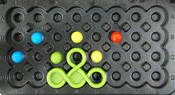
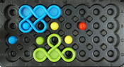
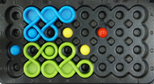
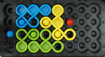
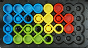
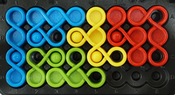

#### Objective 

The game is a puzzle; the objective is to place all eight colored
playing pieces onto a board comprising 32 locations (indents) on which
up to seven colored pegs may be arranged.  The player must place the
pieces such that they fit together correctly on the board, without
overlaps or gaps. Also, each of the pegs must be surrounded by a piece
of the same colour, meaning the piece must have a hole in the
necessary place. In the photo above, a blue peg at upper right is
surrounded by a blue piece, with the peg fitting exactly into a hole
in the blue piece.  The player will need to place the green and red
pieces so that they fit neatly on the green and red pegs, and to
complete the game will need to ensure that all pieces are placed with
no overlaps and no gaps.

A completed game:

#### Challenges

A game starts with a challenge which involves zero or one pieces and
one or more pegs being placed.  Here is what the game above starts
like, ready to be solved (this happens to be challenge 1 that comes
with the game):

Notice that this particular challenge starts with one piece placed and
six pegs placed.  Note that the more constrained the player is, the
fewer options they have, and consequently the solution to the
challenge is, in general, simpler.  For example, many of the 'Wizard'
level challenges that come with the game (e.g. numbers 118-120) have
just three pegs placed, which leaves the player with a large number of
placements to choose from, and thus creates a much more challenging
game.  On the other hand, some of the 'Starter' challenges
(e.g. number 17) have all seven pegs and one piece placed,
significantly reducing the player's options and consequently making
the challenge far easier.

#### Solutions

Each challenge has just one solution.  When comparing solutions, we
ignore piece rotations that take up the same space on the board.  Such
rotations are described as *symmetric*, which is defined in more
detail [below](#strict-symmetry).

The following sequence shows one possible progression of a solution to the game
above (note that the order in which the pieces are played is not important; this
is just one possible ordering).

