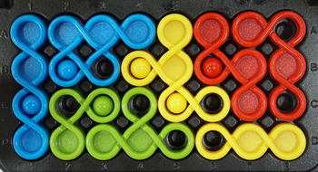

#### Objective 

The game is a puzzle; the objective is to place all eight colored
playing pieces onto a board comprising 32 locations (indents) on which
up to seven colored pegs may be arranged.  The player must place the
pieces such that they fit together correctly on the board, without
overlaps or gaps. Also, each of the pegs must be surrounded by a piece
of the same colour, meaning the piece must have a hole in the
necessary place. In the photo above, a blue peg at upper right is
surrounded by a blue piece, with the peg fitting exactly into a hole
in the blue piece.  The player will need to place the green and red
pieces so that they fit neatly on the green and red pegs, and to
complete the game will need to ensure that all pieces are placed with
no overlaps and no gaps.

A completed game:

